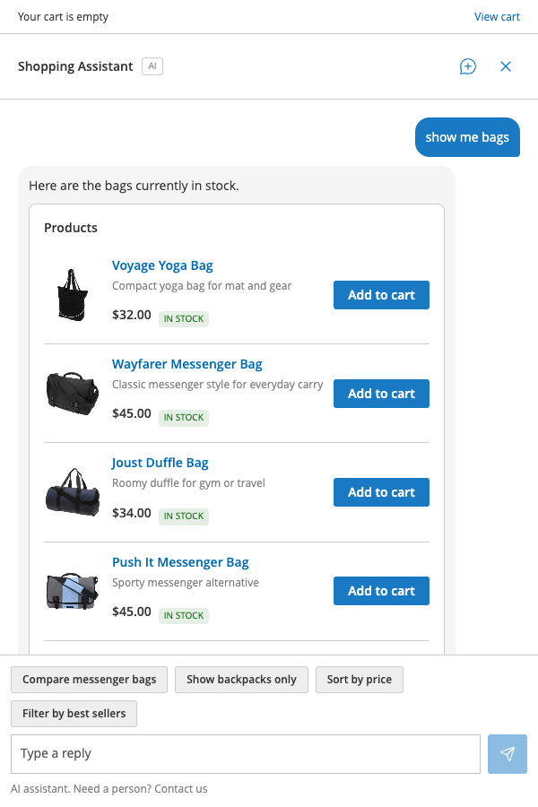
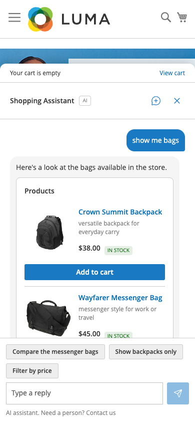

# MageOS_ClaudeConsumerAgent

A shopping assistant for Hyvä and Luma storefronts on Magento 2 and Mage-OS.
It ports Anthropic's open-source shopping agent to a Magento module. The
assistant searches the catalog, explains products, adds them to the cart,
checks orders and answers policy questions from the store's own data. Replies
stream from the Claude Messages API into a side panel on every page.

The module names no store. Every backend call goes through
`Api\StorefrontBackendInterface`, so a store layer can replace or extend any
part without a change to the base module.


## What the customer gets

- A launcher button that opens a panel on the right, or a bottom sheet on a
  phone. The transcript survives page changes and reloads. The assistant is
  absent from the checkout steps and the order success page.
- Product cards with image, price, stock, a one-line reason and Add to cart.
  Configurable products list their sizes and colours first. The assistant
  never picks a variant on its own.
- Cart actions on the store's own quote: add, remove, change quantity, set
  custom options. The header cart count updates at once.
- Answers about the current page. On a category page "what are the best
  sellers here" lists that category. On a product page "does this run small"
  talks about that product.
- Order status for logged-in customers, policy answers quoted from CMS pages,
  and store facts such as gift wrapping or price match from the admin.
- Suggestion chips above the message box, an AI label, and a "Need a person"
  link.

| Start screen | Configurable product | Added to cart |
|---|---|---|
|  |  |  |

| Category page context | Store fact answer | Phone |
|---|---|---|
|  |  |  |

| Luma | Luma phone |
|---|---|
|  |  |

## Requirements

- PHP 8.1 to 8.5
- Magento 2.4 or Mage-OS 3.x with a Hyvä theme on Tailwind 4 (Hyvä default
  theme 1.5 or later) or a theme based on Magento/blank or Magento/luma. Luma
  based themes need no Hyvä package.
- An Anthropic API key with access to the configured model

## Installation

```bash
cd <magento root>
composer require mage-os/module-claude-consumer-agent
bin/magento module:enable MageOS_ClaudeConsumerAgent
bin/magento setup:upgrade
```

For development, clone the repository into
`app/code/MageOS/ClaudeConsumerAgent` instead of the `composer require`.

`setup:upgrade` creates the tables `aiagent_session`, `aiagent_message` and
`aiagent_turn`.

### Hyvä

```bash
bin/magento hyva:config:generate
bin/magento setup:di:compile
```

Then rebuild the theme CSS. `hyva:config:generate` registers the module in
`app/etc/hyva-themes.json`, so the theme build picks up the module templates
and its Tailwind source:

```bash
cd app/design/frontend/<Vendor>/<theme>/web/tailwind
npm ci
npm run build
```

Finish with `bin/magento cache:flush`. In production mode also run
`bin/magento setup:static-content:deploy`.

### Luma

```bash
bin/magento setup:di:compile
bin/magento cache:flush
```

In production mode also run `bin/magento setup:static-content:deploy`. Luma
needs no Tailwind build and no `hyva:config:generate`.

## Configuration

Stores > Configuration > Services > AI Integration > Shopping Assistant. Every
field has default, website and store view scope. Config paths start with
`ai_integration/aiagent/`.

### General


- Enabled: turns the assistant on for the scope.
- Surface Mode: Overlay opens a panel of its own. Cart docks the assistant
  into the Hyvä cart drawer. Header Icon View then decides what the drawer
  opens with: cart, chat, or the last one used. Luma based themes always open
  the panel. Cart mode and Header Icon View apply to Hyvä only.
- Launcher: the round button bottom right. With No, the assistant opens only
  from the product page button, the cart page box and, in Cart mode, the
  header cart icon.
- Keep Open Across Pages: when the shopper leaves the assistant open, it opens
  again on the next page with the conversation restored. Applies to the
  overlay panel and Luma. Hyvä Cart mode and phones keep it closed.
- Product Page Block: the "Ask about this product" button on product pages.
- Streaming Replies: Auto streams each reply word by word. Set Off when a
  proxy or CDN in front of the store buffers responses. See
  [Streaming](#streaming-and-the-json-fallback).

### Model


API key (stored encrypted, never sent to the browser), model id, max tokens,
thinking effort, request timeout and connect timeout.

### Voice


- Brand Name and Assistant Name: shown in the panel header and used in the
  prompt.
- Brand Voice: completes the sentence "Your voice is ..." in the prompt.
- Greeting and Starter Prompts: the first line and the buttons on the start
  screen, one per line.
- Search Hints: one line about this catalog's vocabulary, for example
  "Customers say hoodie for sweatshirt. Sizes are US."

### Content


- Policy Pages: CMS pages the assistant may quote. Empty turns the policy
  tool off.
- Allowed Categories: limits search and product details to these categories.
- Catalog Map: the category tree printed into the system prompt. Depth sets
  how many levels, Roots which top categories start the map (empty means the
  main menu), Max Characters caps the text.
- Store Facts: one row per service or term. Keywords are the customer words
  that trigger it. Source is a text answer, a CMS page or block identifier,
  or Not offered.
- Include Core Facts: facts read from Magento settings: payment methods,
  shipping carriers, gift messages, guest checkout, minimum order amount and
  store contact.

### Product Cards


Yes/No for each part of a product card: image, price, short description,
stock status, Add to cart and the assistant's reason.

### Limits


Caps on load and cost: concurrent turns per store view, turns per session and
per IP, tool rounds per turn, cart quantities and lines, message length,
search results, fenced characters and the prompt size that triggers
compaction. Turn Wall Clock is the number of seconds one reply may keep
calling tools. When it runs out, the assistant answers with what it has.

A running turn holds one PHP-FPM worker. Size `pm.max_children` above
`concurrent_turns` per store view on the pool, plus normal traffic.

### Privacy


- Retention Days: the nightly cron `aiagent_retention` deletes older sessions
  and transcripts.
- Show AI Label: the AI badge next to the assistant name and the line under
  the message box.
- Contact URL and Label: the "Need a person?" link on that line.
- Debug Log: writes full request and response bodies to `var/log/aiagent.log`.
  They contain the cart and the customer profile. Keep it off in production.

### Hidden settings

These paths have defaults in `etc/config.xml` and no admin field. Set them
with `bin/magento config:set`.

| Path | Default | Meaning |
|---|---|---|
| `ai_integration/aiagent/runtime/first_byte_threshold` | 4 | Seconds the browser waits for the first streamed byte before it switches the session to JSON replies |
| `ai_integration/aiagent/runtime/heartbeat_seconds` | 10 | Interval of `: ping` comments while a model call runs |
| `ai_integration/aiagent/lexicon/policy_intent_terms` | word list | Words that force the policy tool |
| `ai_integration/aiagent/lexicon/order_intent_terms` | word list | Words that force the order lookup |

## How a turn works

1. The browser posts `session`, `message`, `page` and `stream` to
   `POST /aiagent/turn/index` with the form key in the `X-Form-Key` header.
2. Grounding rules run before the model. A store fact keyword answers from
   the fact. A policy or order phrase forces that tool. A token that matches
   an existing SKU forces a product read. A first message on a product page
   reads that product.
3. The orchestrator calls the model with the static system prompt (voice,
   catalog map, store facts, tool list) and the session context (cart,
   customer, page). Tool calls run against the store through
   `Api\StorefrontBackendInterface`:
   - catalog: `search_products`, `search_categories`, `get_product_details`
   - cart: `get_cart`, `add_to_cart`, `update_cart_item`, `remove_from_cart`
   - orders and store: `get_orders`, `get_order_status`, `search_policies`,
     `get_fulfillment_options`
   - memory and skills: `get_preferences`, `save_memory`, `recall_memories`,
     `load_skill`
   - cards: `present_products`, `present_comparison`, `present_order_status`,
     `checkout`, `present_suggestions`
4. Gates check every cart write. A configurable product needs every option
   named by the customer in the conversation. Required custom options must
   be set. Quantities and line counts stay under the limits. A refused write
   goes back to the model as a held outcome, so it asks instead of guessing.
5. Events stream to the browser: text deltas, tool status lines, cards,
   suggestion chips, then `turn_complete` with the token usage. The session,
   the messages and a turn log row are saved.

### Page context

Every request carries a `page` object: `page_type` (`home`, `search`,
`product`, `category`, `cart`, `orders` or `other`), `product_id`,
`product_name`, `query`, `category_id` and `category_name`. The server
detects the page from the full action name (`Model\Surface\PageDetector`).
When the page changes between turns, a hidden `[Page: ...]` note is
prepended to the customer message.

### Catalog map

`Model\Agent\Prompt\CatalogMap` prints the category tree with ids into the
static prompt, so the model can pass a `category_id` to `search_products`.
`search_categories` finds deeper categories by keyword. The map is rebuilt
when a category is saved, deleted or moved.

`search_products` accepts a query, a `category_id`, or both. `filters.sort`
takes `price_asc`, `price_desc` or `best_sellers`. Best sellers rank by units
sold over the last two years (`Api\Backend\BestsellerRankInterface`).

### Sale pricing

A product record carries `price`, what the customer pays now, and an
optional `original_price` when the item is marked down: the regular price,
present only when it is at least 0.01 higher than `price`. A record without
`original_price` is not on sale.

### Custom options

Core Magento custom options are part of every product record
(`custom_options`). The model sets them through `add_to_cart` as
`options {"<option title>": "<value title>"}`. Drop-down, radio, checkbox,
multi-select, text and textarea options work in the panel. File, date and
time options hand the customer to the product page. The card then shows
Choose options instead of Add to cart.

## Streaming and the JSON fallback

`POST /aiagent/turn/index` streams Server-Sent Events by default: a `: open`
comment first, one frame per event (`event: <type>\ndata: <json>\n\n`),
`: ping` heartbeats, then `event: turn_complete`. A client can send
`{"stream": 0}` and receive the same events as one JSON body after the turn.

A buffering proxy defeats SSE. Checks and fixes:

- nginx: `proxy_buffering off;` and `gzip off;` on the `aiagent` location
- Apache with mod_proxy_fcgi: no gzip output filter on this route
- Any compression filter holds the whole stream before it flushes

The browser switches a session to JSON replies on its own when the first byte
takes longer than `first_byte_threshold` seconds. If the proxy cannot be
fixed, set Streaming Replies to Off.

Health check through the proxy:

```bash
curl -N -s -X POST https://<store>/aiagent/turn/index \
  -H 'Content-Type: application/json' -H 'X-Form-Key: <form key>' \
  -H 'Cookie: PHPSESSID=<session>; form_key=<form key>' \
  --data '{"session":null,"message":"hello","page":{"page_type":"home"},"stream":1}'
```

Expect `: open` within 200 ms, then event frames, then `event: turn_complete`.
A body that arrives all at once after several seconds means a buffering
proxy.

## Commands

- `aiagent:spike:stream [--store=<code>] [--message="..."] [--product=<id>]
  [--record=<name>] [--raw]`: runs one turn on a throwaway session and prints
  text, tool calls, cards, usage and elapsed time. `--raw` streams the
  Messages client directly. `--record` writes the SSE frames as fixtures.
- `aiagent:eval:run [--cases=<dir>] [--filter=<glob>] [--live]
  [--store=<code>] [--json]`: replays the scripted conversations under
  `Test/Eval/cases` and grades tool calls, cards and cart state. Without
  `--live` an in-memory backend serves every tool call. Exits 1 when a
  critical or high priority case fails.
- `aiagent:usage:report [--days=<n>] [--store=<id>]`: token usage per day
  from `aiagent_turn`.
- `aiagent:session:purge [--older-than=<days>] [--customer=<id>] [--all]
  [--dry-run] [--force]`: deletes sessions and their messages.

## Logging and privacy

`var/log/aiagent.log` gets one INFO line per model call (round, model, stop
reason, token counts, elapsed time), INFO lines on limits and WARNING lines
on tool failures, version conflicts and retries.

The transcript tables hold full conversation content. Retention Days bounds
their life, and `aiagent:session:purge` is the manual escape hatch.
`aiagent_turn` keeps one row per turn with the four usage fields the API
reports, duration and stop reason. No dollar amounts are computed anywhere.

## Lazy loading

On Hyvä every page carries the config store (`js/store.phtml`), the launcher
and, where enabled, the product and cart ask buttons. The panel, the drawer
and every card sit inside `<template data-ai-agent-shell>` elements.
`Alpine.store('aiAgent').mount()` loads `view/frontend/web/js/aiagent.js`
once and clones the shells into the document the first time the assistant
opens.

On Luma every page carries a small config init (`js/luma/init`), the launcher
and an empty `scope: 'aiAgentPanel'` element. The first open loads
`js/luma/view/panel.js`, registers it through `uiLayout` and fetches its
Knockout templates.

## Extension points

A store layer adds behaviour through interfaces and DI pools, never through a
preference on a base concrete class.

1. Backend swap per method group. `Model\Backend\MagentoStorefront`
   delegates to one interface per method group. Replace one with a
   preference:

   ```xml
   <preference for="MageOS\ClaudeConsumerAgent\Api\Backend\SearchProviderInterface"
               type="Vendor\Store\Model\Backend\Provider\CatalogSearch"/>
   ```

   The same works for `CatalogMapProviderInterface`,
   `CategorySearchProviderInterface`, `BestsellerRankInterface`,
   `ProductOptionsProviderInterface`, `SkuMatcherInterface`,
   `PolicySourceInterface`, `FulfillmentProviderInterface` and
   `OrderStatusMapperInterface`.

2. Tools. `Api\Tool\ToolProviderInterface` items pool on
   `Model\Agent\Tool\Registry`:

   ```xml
   <type name="MageOS\ClaudeConsumerAgent\Model\Agent\Tool\Registry">
       <arguments>
           <argument name="providers" xsi:type="array">
               <item name="store" xsi:type="object">Vendor\Store\Model\Tool\StoreToolProvider</item>
           </argument>
       </arguments>
   </type>
   ```

3. Cards. `Api\Presentation\PresentationExtensionInterface` items pool on
   `Model\Agent\Presentation\Registry` under `<argument name="extensions">`.
   The extension registers its own Alpine component the same way `aiagent.js`
   registers the built-in ones. Custom card components render on Hyvä only.
   Luma skips unknown components.

4. Core facts. `Api\Prompt\CoreFactProviderInterface` items pool on
   `Model\Agent\Prompt\CoreFacts` under `<argument name="providers">`.

5. Lexicon and skills. `Model\Agent\Lexicon` takes `additionalPolicyTerms`
   and `additionalOrderTerms` arrays. `Model\Agent\Skill\Loader` takes
   `directories` items (`module`, `path`, `sortOrder`) for extra skill
   folders.

   ```xml
   <type name="MageOS\ClaudeConsumerAgent\Model\Agent\Lexicon">
       <arguments>
           <argument name="additionalPolicyTerms" xsi:type="array">
               <item name="0" xsi:type="string">warranty claim</item>
           </argument>
       </arguments>
   </type>
   ```

6. Cart writes. `Api\Cart\BuyRequestBuilderInterface` builds the
   `DataObject` that `Quote::addProduct()` receives. Replace it or decorate
   it with a plugin.

7. Templates. Every surface and card template resolves through the theme
   fallback. Override by path in a child theme under
   `MageOS_ClaudeConsumerAgent/templates/`. Luma Knockout templates live under
   `MageOS_ClaudeConsumerAgent/web/template/luma/`.

8. Product image URLs. `Api\Backend\ProductImageUrlInterface::forProduct()`
   resolves the image URL for a product card or cart item. The default
   `Model\Backend\Provider\HelperImageUrl` calls the core image helper;
   replace it with a preference to source URLs from elsewhere (a CDN, a
   partial media mirror). Returning null falls back to the helper result:

   ```xml
   <preference for="MageOS\ClaudeConsumerAgent\Api\Backend\ProductImageUrlInterface"
               type="Vendor\Store\Model\Backend\Provider\StoreImageUrl"/>
   ```

9. Config. `Model\Config\StoreConfig::agent()` resolves every field at store
   view scope. A store layer adds fields under its own section and reads them
   itself.

## Tests

- Unit: `vendor/bin/phpunit -c dev/tests/unit/phpunit.xml.dist app/code/MageOS/ClaudeConsumerAgent/Test/Unit`
  (no Magento bootstrap, no database)
- JS (Luma models, Hyvä store and transcript): `node --test app/code/MageOS/ClaudeConsumerAgent/Test/Js/*.test.cjs`
- Integration: `Test/Integration` with the project's integration test
  configuration
- Evals: `bin/magento aiagent:eval:run`

## License

Open Software License (OSL) 3.0, see `LICENSE`.
